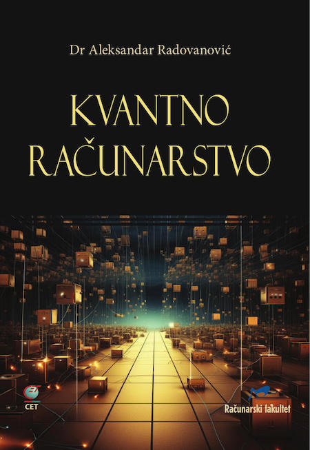

## QLab

QLab praktične programske vežbe predstavljaju uvod u osnovne koncepte i algoritme kvantnog računarstva. Zadaci sa rešenjima pripremljeni su u obliku Python sveski (Notebook) koje se mogu pokretati na ličnom računaru, putem onlajn okruženja ili čak na mobilnim uređajima.

Za dublje razumevanje materije pogledajte knjigu [Kvantno računarstvo](https://cet.rs/proizvod/kvantno-racunarstvo/).

### Kubiti
[Lab 01](Lab01-Blohova_sfera.ipynb): Blohova sfera<br>
[Lab 02](Lab02-Bornovo_pravilo.ipynb): Demonstracija Bornovog pravila<br>

### Kvantna kola
[Lab 03](Lab03-Kvantna_kola.ipynb): Jednostavna kvantna kola<br>
[Lab 04](Lab04-QRNG.ipynb): Kvantni generator slučajnih brojeva<br>
[Lab 05](Lab05-Bell_state.ipynb): Kreiranje i merenje Belovih stanja<br>
[Lab 06](Lab06-Conditional_Bell_State_Encoding.ipynb): Uslovno kodiranje Belovog stanja<br>
[Lab 07](Lab07-Ramsey_phase_estimation.ipynb): Remzijeva estimacija faze<br>
[Lab 08](Lab08-Quantum_Fourier_Transform.ipynb): Kvantna Furijeova transformacija<br>
[Lab 09](Lab09-Kitaev_Phase_Estimation.ipynb): Kitajeva procena faze

### Kvantni algoritmi
[Lab 10](Lab10-Deutsch–Jozsa_algorithm.ipynb): Dojč-Džoza algoritam<br>
[Lab 11](Lab11-Bernstein–Vazirani_algorithm.ipynb): Bernstin-Vazirani algoritam<br>
[Lab 12](Lab12-Simons_algorithm.ipynb): Sajmonov algoritam<br>
[Lab 13](Lab13-Grover_Search_Algorithm.ipynb): Groverov algoritam<br>
[Lab 14](Lab%14-GroverSAT_Solver.ipynb): Groverov SAT rešavač<br>

### Kvantne komunikacije
[Lab 15](Lab15-Supergusto_kodiranje.ipynb): Supergusto kodiranje<br>
[Lab 16](Lab%2016%20-%20Quantum%20Teleportation.ipynb): Kvantna teleportacija<br>

### Kvantna kriptografija
[Lab 17](Lab%2017%20-%20Quantum%20authentication%20protocol.ipynb): Kvantni protokol za autentikaciju<br>
[Lab 18](Lab%2018%20-%20Quantum%20Money.ipynb): Kvantni novac

### Kvantno mašinsko učenje
[Lab 19](Lab%2019%20-%20Grover%20Classifier.ipynb): Groverov klasifikator<br>
[Lab 20](Lab%2020%20-%20Minimal%202-qubit%20QBM.ipynb): Minimalna dvokubitna Kvantna Bornova Mašina(QBM)<br>
[Lab 21](Lab%2021%20-%203-qubit%20QBM.ipynb): Trokubitna QBM za simulaciju kafea<br>
[Lab 22](Lab%2022%20-%204-qubit%202-layer%20QBM.ipynb): 4-kubita, 2-sloja QBM za simulaciju saobraćaja<br>
[Lab 23](Lab%2023%20-%202-Qubit%20VQC%20Classifier.ipynb): Dvokubitni varijacijski kvantni klasifikator

### Uputstvo za Google Colab 

Svi primeri su kompatibilni sa **Google Colab** veb aplikacijom:

1. Otvoriti **[Google Colab](https://colab.google.com/)** i prijaviti se sa Google nalogom.
1. Kliknuti na **File > Open notebook**
2. Kliknuti na **GitHub** tabulator
3. uneti ovaj URL:
   ```
   RAFSoftLab/kvantno-racunarstvo/
   ```

Pre pokretanja, na početak svakog od primera dodati ćeliju koja instalira Qiskit:

```bash
 !pip install -qq -U qiskit qiskit-aer qiskit[visualization] qiskit_ibm_runtime
```
